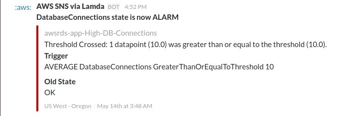
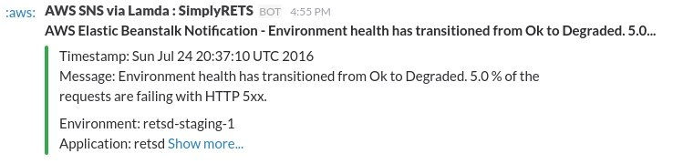

# lambda-cloudwatch-slack

An [AWS Lambda](http://aws.amazon.com/lambda/) function for better Slack notifications.

[](https://travis-ci.org/assertible/lambda-cloudwatch-slack)
[](http://badge.fury.io/js/lambda-cloudwatch-slack)


## Overview

This function was originally derived from the AWS blueprint named `cloudwatch-alarm-to-slack`.
The function in this repo improves on the default blueprint in several ways:

1. Better default formatting

    [](https://assertible.com)

2. Basic support for notifications from Elastic Beanstalk

    [](https://assertible.com)

3. Support for encrypted and unencrypted Slack webhook url


## Testing

```
make test
```

## Configuration


### 1. Configure AWS environment

Fill in the variables at the top of the `Makefile`

For example, your variables may look like this:

```
LAMBDA_FUNCTION_NAME=cloudwatch-to-slack
AWS_REGION=us-west-2
AWS_ROLE=arn:aws:iam::123456789123:role/lambda_exec_role
AWS_PROFILE=myprofile
```


### 2. Configure AWS Lambda script

At the top of the `index.js` file, there are two sections:


#### a. mandatory configuration

Two mandatory configuration


#### b. optional configuration

The variables in the "optional" configuration customize the look and
text in the Slack notification


### 3. Setup Slack hook

Follow these steps to configure the webhook in Slack:

  1. Navigate to https://<your-team-domain>.slack.com/services/new

  2. Search for and select "Incoming WebHooks".

  3. Choose the default channel where messages will be sent and click
     "Add Incoming WebHooks Integration".

  4. Copy the webhook URL from the setup instructions and use it in the next section.


#### Unencrypted hook URL

If you don't want or need to encrypt your hook URL, you can use the `unencryptedHookUrl`.
If this variable is specified, the kmsEncyptedHookUrl is ignored.


#### Encrypted hook URL

Follow these steps to encrypt your Slack hook URL for use in this function:

  1. Create a KMS key - http://docs.aws.amazon.com/kms/latest/developerguide/create-keys.html.

  2. Encrypt the event collector token using the AWS CLI.
     $ aws kms encrypt --key-id alias/<KMS key name> --plaintext "<SLACK_HOOK_URL>"

     Note: You must exclude the protocol from the URL (e.g. "hooks.slack.com/services/abc123").

  3. Copy the base-64 encoded, encrypted key (CiphertextBlob) to the ENCRYPTED_HOOK_URL variable.

  4. Give your function's role permission for the kms:Decrypt action.
     Example:

```
{
    "Version": "2012-10-17",
    "Statement": [
        {
            "Sid": "Stmt1443036478000",
            "Effect": "Allow",
            "Action": [
                "kms:Decrypt"
            ],
            "Resource": [
                "<your KMS key ARN>"
            ]
        }
    ]
}
```
